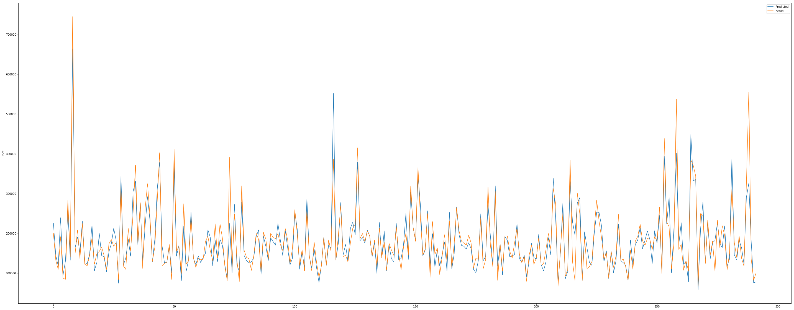

# Housing Price Prediction

- Exploratory Data Analysis (EDA), data cleaning, data wrangling
- Features Selection 
- Building a pipline (optional)
- Models Evaluation : I will evaluate [Multiple Linear Regression](https://towardsdatascience.com/multiple-linear-regression-beginners-guide-5b602d716aa3), [Decision Tree](https://scikit-learn.org/stable/auto_examples/tree/plot_tree_regression.html), [Random Forrest](https://scikit-learn.org/stable/modules/generated/sklearn.ensemble.RandomForestClassifier.html), and [XGBoost](https://xgboost.readthedocs.io/en/latest/tutorials/model.html)
- Picking up the best performing model

##### End Results (Sales Prediction)

